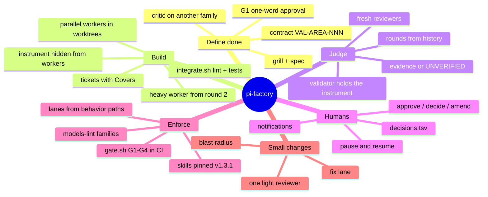
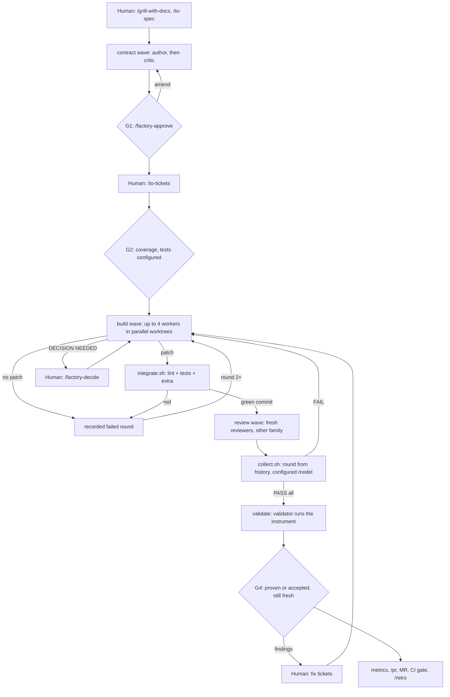

# pi-factory

**An agentic software factory for [Pi](https://github.com/badlogic/pi-mono), run from a laptop.** You write the spec and approve the definition of done. Fresh-context agents build, review and validate in parallel, on separate model families. Scripts, not the model, decide what happens next and keep the record. CI enforces the gates on every merge request.

It applies the principles of Factory's *Missions* to Pi with nothing but agents, prompts, shell scripts and files:

- **Fresh context per role.** Every role is a new subagent with a generated brief of file paths, never the lead's summary.
- **The contract before the code.** A validation contract (assertion IDs) is written, attacked by a critic, and approved by a human before any ticket exists.
- **Validators report and never fix.** A finding becomes a ticket; a wrong assertion becomes an amendment.
- **State in files.** Missions live in `.scratch/<feature>/` and are committed, so any session can pick up.
- **Judges from another model family.** Critic ≠ author, reviewers and validator ≠ workers, linted in CI.

> **Where this stands:** v1.0.0, Step 2 (Parallel) on Boris Cherny's adoption ladder, mechanics and trust layer built, **1 of 4 evidence missions run**. See [docs/LADDER.md](docs/LADDER.md).

---

## Contents

- [The map](#the-map)
- [A mission, end to end](#a-mission-end-to-end)
- [The roles](#the-roles)
- [Quick start](#quick-start)
- [Daily use](#daily-use)
- [What it guarantees, and what it doesn't](#what-it-guarantees-and-what-it-doesnt)
- [Repository layout](#repository-layout)
- [Roadmap](#roadmap)
- [Credits](#credits)

**Start here:** [CHEATSHEET.md](CHEATSHEET.md) (one page, everything you type) · [ADR-001](docs/adr/ADR-001-agentic-factory.md) (every decision and why) · [mission 1 case study](docs/case-studies/mission-01.md)

---

## The map



## A mission, end to end



You type `/factory <feature>` once. The lead loops on `scripts/factory/next.sh`, which prints a `STEP:` code. Machine steps run on their own, and human steps stop the loop and notify you. A ticket that fails three rounds escalates to you; the cause is usually a wrong contract or a ticket that is too big.

## The roles

| Agent | Does | Model guidance | Context |
|---|---|---|---|
| `factory-contract-author` | Writes or amends the validation contract from the spec | Frontier, family A | fresh |
| `factory-contract-critic` | Attacks the contract before you approve it | Frontier, **family ≠ author** | fresh |
| `factory-worker` | Implements one ticket with TDD, in its own worktree | Efficient, family C | fresh |
| `factory-worker-heavy` | Takes over a ticket from round 2 | Frontier, family ≠ judges | fresh |
| `factory-reviewer` | Reviews one integration commit; never fixes | Frontier, **family ≠ workers** | fresh |
| `factory-review-axis` | One code-review axis, dispatched by the reviewer | Same family as the reviewer | fresh |
| `factory-validator` | Runs the hidden instrument; reports findings by root cause | Frontier, **family ≠ workers** | fresh |

The lead (your main Pi session) never implements, reviews or briefs in its own words. It runs scripts and passes generated workflow files by path.

## Quick start

Prerequisites: Pi 1.0+, [pi-subagents](https://github.com/nicobailon/pi-subagents) **0.76.1**, Node 18+, git, a model gateway with at least two model families.

```bash
# 1. Once per laptop
pi install npm:pi-subagents@0.76.1
scripts/factory/install-pi-config.sh          # worktree hook that hides instrument/, concurrency

# 2. Once, in this template repo: your models
#    model: in each .pi/agents/factory/*.md, modelScope.allow in .pi/settings.json,
#    your model names in .factory/model-families.json
node scripts/factory/models-lint.mjs          # MODELS: PASS

# 3. Per target repo: install through its own MR
scripts/factory/install-into.sh "/path/to/your repo"
#    → branch chore/install-pi-factory-<version>, one commit. Then in the target:
#      .factory/commands.env   FACTORY_TEST_CMD (required), lint, extra check, gateway URL
#      .factory/behavior-paths paths that change behavior
#      .gitlab-ci.yml          include: [{ local: .factory/ci/factory.gitlab-ci.yml }]
#      GitLab                  Settings → Merge requests → "Pipelines must succeed"
scripts/factory/doctor.sh                     # in the target repo
```

In Pi, from the target repo: `/subagents-models` shows 7 `factory-*` agents, each on its own model.

## Daily use

| You want to | Type |
|---|---|
| Start or continue a mission | `/factory <feature>` |
| Approve the contract (G1) | `/factory-approve <feature>` |
| Change the contract | `/factory-amend <feature> "<change>"` |
| Answer the question a worker raised | `/factory-decide <feature> <answer> "<why>"` |
| Ship assertions you can't prove yet | `/factory-accept-unverified <feature> <ids\|ALL> "<why>"` |
| Stop for now | `/factory-pause <feature>` → later `/factory <feature>` |
| Make a small fix without a mission | `/factory-fix <slug> start "<what>"`, commit, `/factory-fix <slug> check` |
| See where a mission is | `scripts/factory/next.sh <feature>` |

The full list, with troubleshooting and model notes, is on [the cheat sheet](CHEATSHEET.md).

## What it guarantees, and what it doesn't

**Guaranteed by scripts and CI** (not by a model's goodwill):

- No integration without lint and tests; reviewers only see green, committed code.
- A verdict counts only if `collect.sh` recorded it. Rounds come from history, and the model is the configured one.
- Every behavior assertion is proven, or explicitly accepted as unverified by a named human on a date.
- A judge never shares a model family with what it judges.
- Changing behavior without a mission, or weakening the instrument without an amendment, fails the MR.
- Pinned skills can't drift or be shadowed.

**Not guaranteed (yet):**

- **The wall is soft.** Workers' worktrees don't contain `instrument/`, but a determined agent with bash could look in git history. AGENTS.md forbids it; a separate repo is the hard version.
- **Behavior evidence needs a harness.** Without one, G4 passes only on human acceptance, and the MR shows it under Known limits.
- **Workers have bash in their worktrees.** A deny-list for destructive commands is planned for v1.1.
- **The patch path from the wave depends on pi-subagents' result shape.** `locate-patch.sh` and `record-no-patch.sh` cover a miss, so it is never silent.
- **It is built for one person on a laptop, under a shared request quota.** Concurrency defaults are conservative.

## Repository layout

```
.pi/agents/factory/        7 factory agents (model + thinking in frontmatter)
.pi/prompts/               /factory, /factory-approve|decide|amend|accept-unverified|pause|fix|light
.pi/skills/                mattpocock/skills v1.3.1 (pinned) + contract, contract-critic, verify-behavior
.pi/settings.json          builtins off, model scope, retry for shared quotas
.factory/                  briefs, skills pin, model families, commands.env, behavior-paths, VERSION
scripts/factory/           the factory: next, workflow, brief, integrate, collect, gate, human, fix, …
templates/gitlab/          CI jobs to include in a target repo
instrument/scenarios/      behavior cases, hidden from workers (example)
docs/                      ADR, ladder, case study, retro, roadmap, agent formats
tests/factory.test.sh      end-to-end mission without models (50 checks)
```

## Roadmap

| Release | Theme |
|---|---|
| **v1.0.0** (this) | Records that can't overstate; humans in one word; fix lane |
| v1.0.x | Contract quality: critic format and self-consistency checks, drift check before `/pr`, ticket writer, size-aware routing |
| v1.1.0 | Safety and supervision: destructive-command deny-list, skill intake scan, READY report, security reviewer, install lifecycle |
| v1.2.0 | Proof and scale: bot harness, skill evals, request accounting, dashboard |

Details and status per item: [docs/ROADMAP.md](docs/ROADMAP.md).

## Contributing and releases

Conventional Commits, `develop` is the default branch, `main` carries releases, versions and the changelog come from [semantic-release](https://semantic-release.gitbook.io). See [CONTRIBUTING.md](CONTRIBUTING.md) and [CHANGELOG.md](CHANGELOG.md).

## Credits

- [mattpocock/skills](https://github.com/mattpocock/skills) v1.3.1 (MIT), vendored and pinned in `.pi/skills/`, license in `.factory/skills-pin/`. The only skill foundation.
- [pi-subagents](https://github.com/nicobailon/pi-subagents) for orchestration, and [Pi](https://github.com/badlogic/pi-mono).
- Ideas borrowed (not installed) from Factory's *Missions*, Addy Osmani's agent-skills, pstack and ECC; see [docs/ROADMAP.md](docs/ROADMAP.md).
- Boris Cherny's *Steps of AI Adoption* for the ladder.
