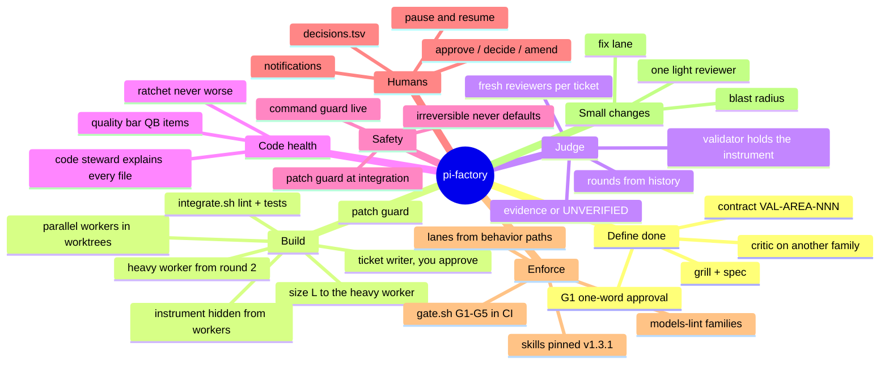
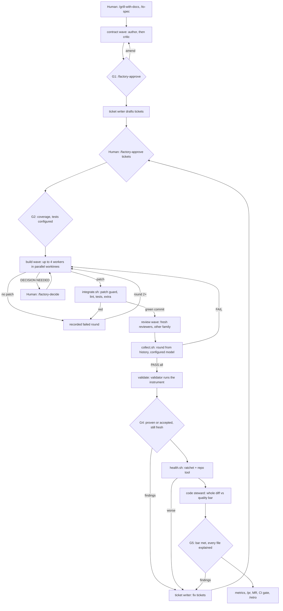

# pi-factory

**An agnostic, agentic software factory for [Pi](https://github.com/badlogic/pi-mono), run from a laptop.** It builds and maintains whatever you work on (a bot, an API, a front end, a batch job, in any language) with the same disciplined loop. What it knows about *your* kind of software and *your* company's taste comes from files you own: `AGENTS.md`, the quality bar, and optional practice packs.

You write the spec and approve the definition of done. Fresh-context agents build, review and validate in parallel, on separate model families. Scripts, not the model, decide what happens next and keep the record. CI enforces the gates on every merge request.

It applies the principles of Factory's *Missions* to Pi with nothing but agents, prompts, shell scripts and files:

- **Fresh context per role.** Every role is a new subagent with a generated brief of file paths, never the lead's summary.
- **The contract before the code.** A validation contract (assertion IDs) is written, attacked by a critic, and approved by a human before any ticket exists.
- **Validators report and never fix.** A finding becomes a ticket; a wrong assertion becomes an amendment.
- **State in files.** Missions live in `.scratch/<feature>/` and are committed, so any session can pick up.
- **Judges from another model family.** Critic ≠ author; reviewers, validator and code steward ≠ workers, linted in CI.
- **The codebase is the fuel.** Every mission must leave it safe, understandable by any human, battle-tested and predictable: a measured ratchet plus a code steward judge it against a written quality bar before it can merge.
- **Agents can't do harm.** A command guard blocks dangerous tool calls live; a patch guard rejects unsafe changes deterministically.
- **Agnostic machinery, owned content.** No language or framework baked in. Practices arrive as content the existing roles read, never as new code.

> **The goal:** shift the work, not the volume. Correction and maintenance run in the background, verified by the factory itself, so the team spends its time on what was never in scope. See [docs/INTENT.md](docs/INTENT.md).

> **Where this stands:** v1.1, Step 2 (Parallel) on Boris Cherny's adoption ladder, mechanics and trust layer built, **1 of 4 evidence missions run**. See [docs/LADDER.md](docs/LADDER.md).

---

## Contents

- [The map](#the-map)
- [A mission, end to end](#a-mission-end-to-end)
- [The roles](#the-roles)
- [Quick start](#quick-start)
- [Daily use](#daily-use)
- [Practice packs](#practice-packs)
- [What it guarantees, and what it doesn't](#what-it-guarantees-and-what-it-doesnt)
- [Repository layout](#repository-layout)
- [Roadmap](#roadmap)
- [Credits](#credits)

**Start here:** [INTENT.md](docs/INTENT.md) (why it exists and how we measure the gain) · [DESIGN.md](docs/DESIGN.md) (how it works and why, one idea per section) · [CHEATSHEET.md](CHEATSHEET.md) (everything you type) · [ADR-001](docs/adr/ADR-001-agentic-factory.md) (every decision, in order) · [mission 1 case study](docs/case-studies/mission-01.md)

---

## The map



## A mission, end to end



You type `/factory <feature>` once. The lead loops on `scripts/factory/next.sh`, which prints a `STEP:` code. Machine steps run on their own, and human steps stop the loop and notify you. A ticket that fails three rounds escalates to you; the cause is usually a wrong contract or a ticket that is too big.

## The roles

| Agent | Does | Model guidance | Context |
|---|---|---|---|
| `factory-contract-author` | Writes or amends the validation contract from the spec | Frontier, family A | fresh |
| `factory-contract-critic` | Attacks the contract before you approve it | Frontier, **family ≠ author** | fresh |
| `factory-ticket-writer` | Drafts sized, ordered tickets (and fix tickets from findings); you approve | Frontier, any family | fresh |
| `factory-worker` | Implements one ticket with TDD, in its own worktree | Efficient, family C | fresh |
| `factory-worker-heavy` | Takes over a ticket from round 2 | Frontier, family ≠ judges | fresh |
| `factory-reviewer` | Reviews one integration commit; never fixes | Frontier, **family ≠ workers** | fresh |
| `factory-review-axis` | One code-review axis, dispatched by the reviewer | Same family as the reviewer | fresh |
| `factory-validator` | Runs the hidden instrument; reports findings by root cause | Frontier, **family ≠ workers** | fresh |
| `factory-code-steward` | Judges the whole mission diff against the quality bar; explains every changed file (G5) | Frontier, **family ≠ workers** | fresh |

The lead (your main Pi session) never implements, reviews or briefs in its own words. It runs scripts and passes generated workflow files by path.

## Quick start

Prerequisites: Pi 1.0+, [pi-subagents](https://github.com/nicobailon/pi-subagents) **0.76.1**, Node 18+, git, a model gateway with at least two model families.

```bash
# 1. Once per laptop
pi install npm:pi-subagents@0.76.1
scripts/factory/install-pi-config.sh          # worktree hook that hides instrument/, concurrency

# 2. Once, in this template repo: your models
#    model: in each .pi/agents/factory/*.md, modelScope.allow in .pi/settings.json,
#    your model names in .factory/model-families.json
node scripts/factory/models-lint.mjs          # MODELS: PASS

# 3. Per target repo: install through its own MR
scripts/factory/install-into.sh "/path/to/your repo"
#    → branch chore/install-pi-factory-<version>, one commit. Then in the target:
#      .factory/commands.env   FACTORY_TEST_CMD (required), lint, extra check, health tool, gateway URL
#      .factory/behavior-paths paths that change behavior
#      docs/agents/quality-bar.md  the bar G5 judges against (sharpen it)
#      .gitlab-ci.yml          include: [{ local: .factory/ci/factory.gitlab-ci.yml }]
#      GitLab                  Settings → Merge requests → "Pipelines must succeed"
scripts/factory/doctor.sh                     # in the target repo
```

In Pi, from the target repo: trust the project once (it loads the command guard), then `/subagents-models` shows 9 `factory-*` agents, each on its own model.

## Daily use

| You want to | Type |
|---|---|
| Start or continue a mission | `/factory <feature>` |
| Approve the contract (G1) | `/factory-approve <feature>` |
| Approve the proposed tickets | `/factory-approve <feature> tickets` |
| Change the contract | `/factory-amend <feature> "<change>"` |
| Answer the question a worker raised | `/factory-decide <feature> <answer> "<why>"` |
| Ship assertions you can't prove yet | `/factory-accept-unverified <feature> <ids\|ALL> "<why>"` |
| Stop for now | `/factory-pause <feature>` → later `/factory <feature>` |
| Make a small fix without a mission | `/factory-fix <slug> start "<what>"`, commit, `/factory-fix <slug> check` |
| See where a mission is | `scripts/factory/next.sh <feature>` |

What stays manual, what is automatic and why, the full list of commands, troubleshooting and model notes: [the cheat sheet](CHEATSHEET.md).

## Practice packs

The factory doesn't know whether you're building an API or a bot; packs tell it, as plain markdown the existing roles already read. No new role, no new script.

| Pack | What it adds |
|---|---|
| `api` | Stripe-inspired conventions: one error shape, idempotency keys, cursor pagination, request IDs, additive changes; **Public** items for third-party APIs (versioning, signed webhooks) |
| `batch` | Exit codes, counts that add up, safe re-runs, caps, dry-run, no overlap, stop on upstream failure |
| `bot` | Conversational bots: routing, tools, prompt injection, multi-turn |

`install-into.sh <repo> --pack api`. Each pack is a checklist for the contract critic (G1) and `QB-` items for the code steward (G5); both are yours to edit once installed. **On a blank page, install the pack:** conventions are cheapest before the first line. **On existing code, prune it first:** consistency with what's there beats any ideal. Details: [packs/README.md](packs/README.md).

## What it guarantees, and what it doesn't

**Guaranteed by scripts and CI** (not by a model's goodwill):

- No integration without lint and tests; reviewers only see green, committed code.
- A verdict counts only if `collect.sh` recorded it. Rounds come from history, and the model is the configured one.
- Every behavior assertion is proven, or explicitly accepted as unverified by a named human on a date.
- A judge never shares a model family with what it judges.
- Changing behavior without a mission, or weakening the instrument without an amendment, fails the MR.
- A mission can't make measured code health worse (ratchet), and can't merge until a steward from another family has judged it against the quality bar and explained every changed file.
- No worker patch lands if it touches the instrument, the factory, CI or hooks, deletes or skips a test, silences a check, or adds something that looks like a secret.
- Pinned skills can't drift or be shadowed.

**Not guaranteed (yet):**

- **The wall is firmer, not absolute.** Workers' worktrees don't contain `instrument/`, and the command guard blocks routes to it (git show, git log, reads). A separate repo is the hard version.
- **Behavior evidence needs a harness.** Without one, G4 passes only on human acceptance, and the MR shows it under Known limits.
- **The command guard is a deny-list, and it loads only in a trusted project.** It stops the known dangerous commands, not every possible one; that is why the patch guard and CI stand behind it. Whether pi-subagents children load project extensions is to be confirmed on mission 2 (the patch guard holds either way). An OS sandbox for agent commands is next (roadmap S8, see the [sandboxing study](docs/research/agent-sandboxing.md)).
- **The steward is a model.** The ratchet and the "explain every file" check are mechanical; the judgement on clarity is not. Two families and evidence per item limit the risk; your review of the MR stays.
- **The patch path from the wave depends on pi-subagents' result shape.** `locate-patch.sh` and `record-no-patch.sh` cover a miss, so it is never silent.
- **It is built for one person on a laptop, under a shared request quota.** Concurrency defaults are conservative.

## Repository layout

```
.pi/agents/factory/        9 factory agents (model + thinking in frontmatter)
.pi/extensions/            factory-guard.ts: the command guard
.pi/prompts/               /factory, /factory-approve|decide|amend|accept-unverified|pause|fix|light
.pi/skills/                mattpocock/skills v1.3.1 (pinned) + contract, contract-critic, verify-behavior, ticket-writer, code-steward
.pi/settings.json          builtins off, model scope, retry for shared quotas
.factory/                  briefs, skills pin, model families, commands.env, behavior-paths, VERSION
scripts/factory/           the factory: next, workflow, brief, integrate, collect, gate, human, fix, …
templates/gitlab/          CI jobs to include in a target repo
instrument/scenarios/      behavior cases, hidden from workers (example)
packs/                     practice packs: api, batch, bot (checklists + quality-bar items)
docs/                      design guide, ADR, ladder, case study, retro, roadmap, agent formats, quality bar
tests/                     end-to-end mission without models (71 checks), guard rule tests
```

## Roadmap

| Release | Theme |
|---|---|
| v1.0.0 | Records that can't overstate; humans in one word; fix lane |
| **v1.1.0** (this) | Code health (G5: ratchet + code steward), command and patch guards, ticket writer, size routing, practice packs (api, batch, bot), MIT licence |
| next | Contract quality and supervision: critic checks, drift check, draft MR from the factory, READY report, security reviewer, skill intake scan, install lifecycle |
| later | Proof and scale: bot harness, skill evals, request accounting, dashboard. After Step 2: a durable mission runner on Pi Durable |

Details and status per item: [docs/ROADMAP.md](docs/ROADMAP.md).

## Contributing and releases

Conventional Commits, `develop` is the default branch, `main` carries releases, versions and the changelog come from [semantic-release](https://semantic-release.gitbook.io). See [CONTRIBUTING.md](CONTRIBUTING.md) and [CHANGELOG.md](CHANGELOG.md).

## Licence

[MIT](LICENSE). The vendored mattpocock/skills keep their own MIT licence (`.factory/skills-pin/`).

## Credits

- [mattpocock/skills](https://github.com/mattpocock/skills) v1.3.1 (MIT), vendored and pinned in `.pi/skills/`, license in `.factory/skills-pin/`. The only skill foundation.
- [pi-subagents](https://github.com/nicobailon/pi-subagents) for orchestration, and [Pi](https://github.com/badlogic/pi-mono).
- Ideas borrowed (not installed) from Factory's *Missions*, Addy Osmani's agent-skills, pstack and ECC; see [docs/ROADMAP.md](docs/ROADMAP.md).
- Boris Cherny's *Steps of AI Adoption* for the ladder.
