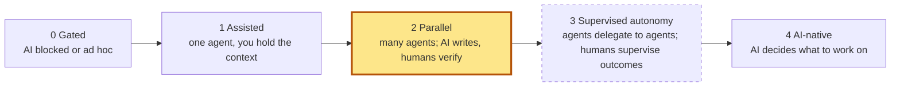

# Where I operate on the ladder

Boris Cherny's *Steps of AI Adoption* (July 2026), and where this factory stands on it. Update this file after every mission retro. It is the honest answer to "are we at Step 2 yet?".

**Now:** Step 2 mechanics, trust layer and code-health gate built (v1.1.0). **Evidence: 1 mission of 4.**
**Target:** declare Step 2 solidly, from a laptop. **Long-term goal:** Step 3, still from a laptop.

---

## Step 2: what it takes, and the status

| Ingredient | Status | Where |
|---|---|---|
| Agents in isolated worktrees, in parallel | ✅ in use (laptop-limited to 1–4 by quota) | D16, D27, D35 |
| A definition of done written before code | ✅ contract + critic + human approval | D4–D7 |
| A self-verification loop you trust | ✅ integration gate, fresh reviewers, validator | D8, D12, D34 |
| Review by another model family | ✅ enforced by lint in CI | D13, D31 |
| Records that can't overstate | ✅ v1.0.0: rounds, models, evidence written by scripts | D38–D40 |
| Gates nobody can skip silently | ✅ CI template; requires "Pipelines must succeed" | D9 |
| Humans decide quickly, never watch | ✅ v1.0.0: one-word gates, notifications, pause | D43, D45 |
| Tickets without hand-writing | ✅ v1.1.0: ticket writer, you approve in one word | D52 |
| Code health held mission after mission | ✅ v1.1.0: ratchet + code steward against a written quality bar (G5) | D49, D50 |
| Behavior proven, not assumed | ⚠️ no harness yet: G4 relies on human acceptance | D14, D40 |
| No permission prompts or destructive commands | ✅ v1.1.0: command guard live, patch guard at integration (loading in subagents to confirm on mission 2) | D51 |

## Exit criteria for Step 2

Declared when, **over 4 missions**:

1. 3–4 tickets per wave as routine.
2. MRs approved from verdicts and metrics, with spot checks only.
3. First-pass review rate and escaped bugs stable or improving.
4. Zero unexplained bypasses.

## Evidence log

One row per mission, from `metrics.sh` and the retro.

| # | Mission (anonymized) | Tickets | Max per wave | First pass | Escaped bugs | Bypasses | Human interventions | Notes |
|---|---|---|---|---|---|---|---|---|
| 1 | Batch bot feature (clean up expired records) | 9 (3 added mid-mission) | 1 (quota) | not trustworthy (pre-1.0 rounds) | 0 known | 0 | many: see retro | [case study](case-studies/mission-01.md) |
| 2 | | | | | | | | first mission on v1.1.0: confirm the guard loads in subagents, the patch path, the steward's cost |
| 3 | | | | | | | | |
| 4 | | | | | | | | |

Criteria check after mission 1: **2 ✗** (wave size limited by the quota, not the factory), **1 partial**, **3 not measurable** (fixed by v1.0.0), **4 ✓**.

## What blocks the next criteria

| Blocker | Effect | Plan |
|---|---|---|
| Shared request quota (about 10 per window) | Waves of 1; slow missions | Request accounting (v1.2) → evidence for a quota request |
| No bot harness | G4 needs human acceptance | Harness as its own mission (v1.2) |
| Lead model stability | One repetition loop in mission 1 | Watchdog rule (v1.0), steadier lead model |

## Toward Step 3 (from a laptop)

Step 3 means agents delegate to agents and you supervise outcomes and exceptions, not steps. What exists and what's missing:

| Needed | Status |
|---|---|
| Nested delegation (reviewer → axes) | ✅ depth 2 in use |
| Durable missions, resumable from files | ✅ state in files, pause/pickup (v1.0) |
| Escalation only on exceptions | ✅ STEP codes + notifications; ⚠️ the contract and tickets are still yours |
| Supervision you can read at a glance | ❌ READY report (v1.3), dashboard (v1.4) |
| Safe autonomy: sandbox, least privilege, kill switch, no default egress | ⚠️ guards in place (D51); OS sandbox, short-lived credentials and kill switch still to do (S5); Pi Durable execution environments are the candidate (X13) |
| Unattended missions that survive crashes, steerable from anywhere | ❌ candidate: a thin runner on Pi Durable (X13), after Step 2 |
| Code that stays understandable without a human reading every line | ✅ G5 steward + ratchet; your MR review becomes a spot check |
| Triggered work (issue → mission) | ❌ after Step 2 is declared |

**Next:** run mission 2 on v1.1.0, do the retro, then contract quality and supervision (v1.3).
